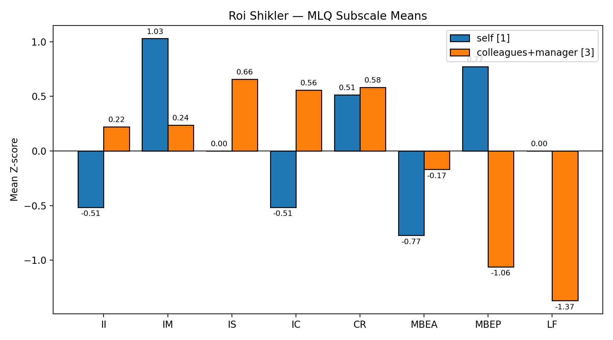
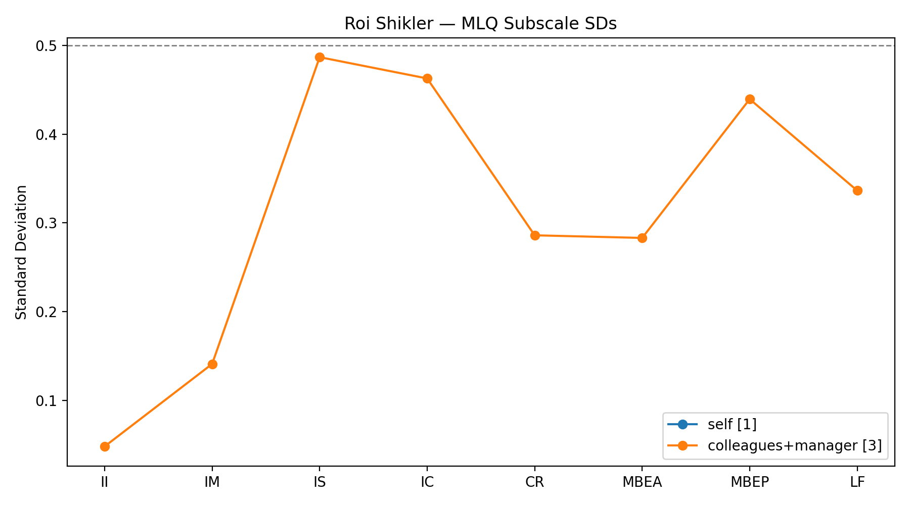

# MLQ Analysis + SMART/OKR-style Development Plan

## Individual Leadership Development Plan (MLQ – Full Range Leadership)

### 1. Context: My Role and the 360° Feedback Process

I currently work as a Product Manager in an early-stage startup building an agent-to-agent communication platform. I am the first PM in the company, working on the core product. Previously, I worked as a Product Manager at a large publicly traded company, where I owned a specific product within a broader suite. In both roles, my leadership is matrix-based - influence without formal authority - but the previous matrix was significantly larger and more structured.

The shift from a large organization to a startup has changed the nature of my work considerably: tighter scope, closer proximity to execution, and broader ownership. Different scales, same constraint: leading through influence, not authority.

**Respondent selection and limitations:**
I sent the MLQ questionnaire to colleagues from both my current and previous roles. Finding suitable respondents was challenging: my last manager at the corporate was my peer for most of our working relationship, and the remaining respondents are developers and stakeholders rather than fellow PMs. As a result, each respondent observes a different facet of my leadership - some see me in strategic discussions, others in day-to-day execution. This shows up in the SD graph (section 2.3): subscales like IS, IC, and MBEP have higher dispersion, likely because raters experience these behaviors in different contexts.

This document translates the MLQ 360° results into a focused improvement plan, using SMART goals and an OKR-like structure.

---

### 2. Results Overview and Gaps Identified

#### 2.1 MLQ subscale means (Z-scores)
The MLQ results are presented as standardized scores (Z-scores) relative to a reference norm: positive values indicate above-average frequency, and negative values indicate below-average frequency.

**Self vs. Others (Colleagues + Manager):**
- II: Self -0.51 | Others 0.22
- IM: Self 1.03 | Others 0.24
- IS: Self 0.00 | Others 0.66
- IC: Self -0.51 | Others 0.56
- CR: Self 0.51 | Others 0.58
- MBEA: Self -0.77 | Others -0.17
- MBEP: Self 0.77 | Others -1.06
- LF: Self 0.00 | Others -1.37

#### 2.2 Interpretation (Full Range Leadership)
In the "ideal" Full Range Leadership profile, transformational leadership (II/IM/IS/IC) tends to be above average, contingent reward (CR) slightly positive, and passive/avoidant factors (MBEP/LF) very low. MBEA is typically low-to-moderate: used to detect and correct deviations early without becoming overly controlling.

**Overall picture (according to others):**
- Others perceive me as relatively strong on transformational leadership, especially IS and IC.
- Others perceive very low passive/avoidant leadership (low MBEP and very low LF), indicating that they do not experience me as disengaged.

**Key gaps:**
- **IM perception gap:** I rate my inspirational motivation much higher than others do, implying that my internal focus on vision and meaning may not consistently translate into a shared narrative externally.
- **MBEA below target:** While MBEA is typically kept low for general managers, product management requires tighter early detection of delivery risks. Both my self-rating (-0.77) and others' rating (-0.17) fall below zero - I want to bring this above average.

#### 2.3 Standard deviation graph (agreement among raters)

Dispersion stays below 0.5 across subscales, which is acceptable. IS, IC, and MBEP show higher spread - probably because raters see me in different contexts. With only three raters, these patterns hint rather than prove.

---

### 3. Focus Areas Selected (and Why)

I chose two areas that matter most for my work:

1) **Inspirational Motivation (IM)**
As a product leader, I want vision to function as a practical decision-making tool - not only a message. I want teammates and stakeholders to propose initiatives and make decisions aligned with the long-term direction without depending on me.

2) **Management-by-Exception Active (MBEA)**
In product execution, schedule drift is expensive. I want to strengthen early detection and risk reduction without micromanaging - intervening through scope decisions, prioritization, dependency removal, and escalation (not through solution interference).

---

### 4. Transformation Plan (SMART / OKR-like)

## Objective 1 (IM): Make the vision a shared tool that increases autonomous decisions and initiatives

**Time-bound window:** 8–10 weeks

### Key Results (measurable outcomes)
- **KR1:** At least **2 decisions or priority choices per month** are made by *developers themselves* and explicitly justified using a shared "why/vision" principle (not only urgency or short-term constraints).
- **KR2:** At least **1 instance per month** where a developer proactively proposes or re-prioritizes work based on the vision/long-term direction without being prompted.

### Personal Actions (habits)
1) **Weekly "Why + Long-Term Direction" closing ritual**
   Once per week, at the end of the product + dev + CTO status meeting, I will close with a 60–90 second summary:
   - our purpose and the value we create for customers,
   - the longer-term direction,
   - and how the week's priorities connect to that direction.

2) **1–2 explicit "line-of-sight" statements per week**
   Each week I will choose 1–2 key topics and craft one sentence linking them to the long-term narrative: "We are doing X in order to enable Y."

3) **A closing autonomy question**
   At the end of major discussions I will ask: "What did we decide, and what in the vision/principle guided that decision?"
   This reinforces that vision is used, not only heard.

**Success signal (qualitative):**
- More initiatives and decisions emerge from others that are already aligned with the vision (reduced dependency on me as the approval node).

---

## Objective 2 (MBEA): Reduce schedule surprises through early detection and immediate risk-reduction moves

**Time-bound window:** 8–10 weeks

### Key Results (measurable outcomes)
- **KR1:** Reduce the number of tasks that remain **In Progress > 4 days** by **50%** relative to baseline measured in week 1.
- **KR2:** Reduce the number of items in **triage > 3 weeks** by **70%** relative to baseline measured in week 1.

### Guardrails (anti-micromanagement)
My red lines are:
- I will not intervene in coding or solution design.
- I will not request daily status updates.
I will intervene only through: scope decomposition, prioritization, removing dependencies, clarifying acceptance criteria, and escalation.

### Personal Actions (habits)
1) **Exception-only scan (3 minutes)**
   Each morning, I will quickly scan only for the two exceptions:
   - In Progress > 4 days
   - triage > 3 weeks
   This is not a daily status ritual - only exception visibility.

2) **Immediate decomposition + momentum**
   When an exception triggers, I will:
   - break the work into smaller deliverables,
   - tighten scope and acceptance criteria,
   - remove dependencies / escalate as needed,
   - and ensure immediate forward movement (including personal involvement in coordination -not in technical execution).

3) **One risk-focused question**
   When an exception triggers, I ask only:
   "What is the main blocker/risk, and what is the next step that reduces risk?"
   I then act where I should - scope, priority, dependencies, escalation - not in implementation.

---

### 5. Expected impact
Done right, this makes the "why" a working decision tool - not just a slide. And catching delivery risks early should reduce surprises without turning me into a micromanager.

---

### 6. Baseline Measurements (Week 1: 2026-01-28)

| Metric                     | Baseline | Target (8–10 weeks)     |
| -------------------------- | -------- | ----------------------- |
| Tasks In Progress > 4 days | 75%      | ≤ 37.5% (50% reduction) |
| Items in Triage > 3 weeks  | 12.5%    | ≤ 4% (70% reduction)    |

